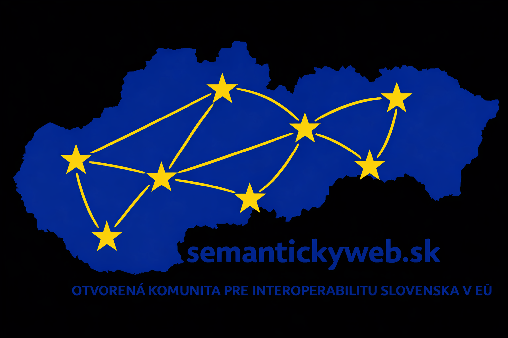

# Centrálny model údajov verejnej správy (komunitná verzia semantickyweb.sk 2026)

Tento repozitár predstavuje komunitné pokračovanie projektu Centrálneho
modelu údajov verejnej správy.

Pôvodný repozitár, ktorý vznikol počas pôsobenia autora na MIRRI, je
dostupný tu:\
👉 https://github.com/slovak-egov/centralny-model-udajov

Aktuálny rozvoj modelu prebieha v rámci komunity **semantickyweb**:\
👉 https://github.com/semantickyweb/centralny-model-udajov

Cieľom tejto verzie je otvorený odborný rozvoj modelu, jeho ontologické
rozšírenia a experimentálne vetvy zamerané na konkrétne európske dátové
štandardy.

------------------------------------------------------------------------

## Tématické rozvojové vetvy

Tento repozitár obsahuje samostatné vetvy zamerané na konkrétne oblasti:

### 🔹 ELM - European Learning Model (Školstvo)

Vetva rozširujúca CMÚ o ontológiu ELM:\
👉
https://github.com/semantickyweb/centralny-model-udajov/tree/feature/elm

### 🔹 ERA - European Union Agency for Railways (Doprava)

Vetva rozširujúca CMÚ o ontológiu ERA:\
👉
https://github.com/semantickyweb/centralny-model-udajov/tree/feature/era

### 🔹 ELI - European Legislation Identifier Ontology (Legislatíva)

Vetva rozširujúca CMÚ o ontológiu ELI:\
👉
https://github.com/semantickyweb/centralny-model-udajov/tree/feature/eli

### 🔹 ESCO - European Skills, Competences, Qualifications and Occupations (Zamestnanosť)

Vetva rozširujúca CMÚ o ontológiu ESCO:\
👉
https://github.com/semantickyweb/centralny-model-udajov/tree/feature/esco

### 🔹 DCAT-AP-SK Rozhranie katalógu otvorených dát DCAT-AP-SK (Otvorené údaje)

Vetva rozširujúca CMÚ o DCAT-AP-SK:\
👉
https://github.com/semantickyweb/centralny-model-udajov/tree/feature/dcat-ap-sk

------------------------------------------------------------------------

## Čo je CMÚ?

Centrálny model údajov verejnej správy je budovaný vo forme
**znalostného grafu**.\ a jeho funkciou je jednotná špecifikácia
dátových štruktúr ISVS.

Model sa skladá z troch hlavných častí:

-   **TBOX (Terminology Box)** -- množina ontológií (dátových modelov) a doménových
    pravidiel\
-   **CBOX (Category Box)** -- číselníky, hierarchie, tezaury a
    klasifikačné schémy\
-   **ABOX (Assertions Box)** -- konkrétne inštančné dáta (príklady) s ich
    hodnotami a vzájomnými vzťahmi

V rámci CMÚ sa ABOX používa najmä na prezentáciu príkladových dát, ktoré
sú definované TBOX-om a klasifikované prostredníctvom CBOX-u.

Verzia CMÚ je aplikačne prístupná prostredníctvom portálu:\
👉 https://znalosti.gov.sk (!pôvodný stav z roku 2023 bez aktualizácií!)
------------------------------------------------------------------------

## Komunita semantickyweb.sk
 
Komunita **semantickyweb.sk** si kladie za cieľ podporovať verejnú správu pri pokračovaní adopcie 
a implementácie európskych dátových štandardov primárne v ISVS. 

Osobitný dôraz sa kladie na:

- podporu implementácie **Aktu o interoperabilnej Európe (Interoperable Europe Act)**
- podporu implementácie **Smernice o otvorených dátach (Open Data Directive)**
- zosúlaďovanie národných dátových modelov s európskymi referenčnými modelmi
- rozvoj znalostných grafov a sémantických technológií vo verejnej správe

Cieľom je prispieť k vyššej interoperabilite, kvalite a opakovateľnému využívaniu dát v prostredí verejnej správy.

------------------------------------------------------------------------

## Pridajte sa ku komunite

Staňte sa členom komunity **semantickyweb.sk** a prispejte k rozvoju Centrálneho modelu údajov (CMÚ):

- vlastnou požiadavkou na rozšírenie modelu
- návrhom na zlepšenie existujúcich ontológií
- ontologickým rozšírením alebo novým aplikačným profilom
- odbornou diskusiou k dátovej interoperabilite
- implementáciou projektu s podporou CMÚ interoperability
- prípravou návrhu konkrétneho projektu v spolupráci s vašou organizáciou
- pilotným overením modelu v reálnom informačnom systéme
- zdieľaním praktických skúseností z implementácie

Členom komunity sa môžu stať **nielen fyzické osoby** (odborníci, architekti, analytici, vývojári),  
ale aj **firmy, verejné inštitúcie a technologickí partneri**, ktorí chcú aktívne prispieť k rozvoju dátovej interoperability na Slovensku.

Spoločne môžeme zlepšovať dátovú interoperabilitu informačných systémov verejnej správy a budovať otvorený, udržateľný znalostný model.

---

## Ako prispieť

Prispievať je možné prostredníctvom GitHubu:

1. Vytvorte fork repozitára `semantickyweb/centralny-model`
2. Vytvorte vlastnú vetvu so zmenami
3. Otvorte Pull Request
4. Po schválení bude zmena začlenená do hlavnej vetvy

Alternatívou k forkovaniu je pracovať priamo v organizácii `semantickyweb`.  
V takom prípade stačí požiadať o prístup do repozitára.

Navrhované zmeny, rozšírenia alebo nové iniciatívy radi prediskutujeme spoločne ešte pred ich zapracovaním — cieľom je hľadať konsenzus a budovať model transparentne a odborne.

Dlhodobým cieľom je po odbornej dohode predkladať vybrané návrhy ako pracovné materiály do pracovnej skupiny PS1 a — v prípade ich relevancie a širšej podpory — postupne smerovať k ich zohľadneniu v oficiálnych štandardoch (napr. formou vyhlášky). Ide však o víziu do budúcnosti; aktuálnym cieľom je budovanie kvalitného a odborne podloženého modelu.

V prípade záujmu o spoluprácu alebo získanie priamych práv na zápis do repozitára nás kontaktujte na:  
📧 **komunita@semantickyweb.sk**

---

Projekt Rozšírenia CMÚ 2026, ako aj komunita **semantickyweb.sk**, je iniciovaná a podporovaná spoločnosťou **Liskatech** a je otvorená spolupráci s jednotlivcami aj organizáciami, ktoré chcú aktívne participovať na budovaní interoperabilného dátového ekosystému informačných systémov verejnej správy.
